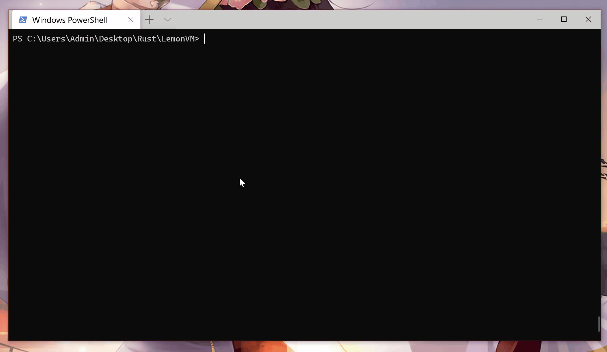
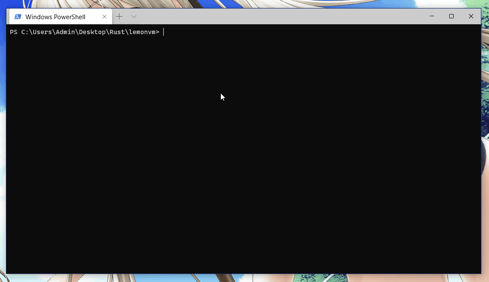

# LemonVM

## Dependencies 依赖
llvm (libclang for FFI)

---

### VM runs binary file

### VM debugger

---

Chinese

## 欢迎使用柠檬虚拟机（柠檬VM，LemonVM）

这是柠檬虚拟机（以后将统称为柠檬VM)
- [柠檬VM 主页](https://github.com/lemonhx/lemonvm)
- [柠檬VM BUG追踪](https://github.com/LemonHX/LemonVM/labels/bug)

如果想要学习柠檬VM，我们什么资料也没有~

## 什么是柠檬VM？

柠檬VM是一个使用高性能的Rust语言的基于寄存器的虚拟机，借鉴了JVM和LuaJIT的实现思想的一个开源的虚拟机[开源协议](https://github.com/LemonHX/LXXSDT-License)，使用之前请仔细阅读。

## 柠檬VM的目标是什么？

目标是快速，字节码可读，且编程语言友好。
下一步将会向着硬件友好（JIT技术或AOT技术），内存友好的方向努力。

还有就是国内<del>@某个方舟</del>对于VM的研究屈指可数，但是往往缺乏学习资料，要么就是代码太多，不利于下手，柠檬VM将使用最少的魔法去实现，以方便大家学习。

## 我能帮柠檬吗？

可以，请私信QQ：`1332127468`

## Welcome to use Lemon Virtual Machine (Lemon VM, LemonVM)
- [Lemon VM Homepage](https://github.com/lemonhx/lemonvm)
- [Lemon VM BUG Tracking](https://github.com/LemonHX/LemonVM/labels/bug)

If you want to learn Lemon VM, we have no information ~

## What is Lemon VM?

Lemon VM is a register-based virtual machine using high-performance Rust language. It is an open source virtual machine [open source license](https://github.com/LemonHX/LXXSDT-License) that draws on the implementation ideas of JVM and LuaJIT. Please read the license carefully before using it.

## What is the goal of Lemon VM?

The goal is fast, bytecode readable, and programming language friendly.
The next step will be towards hardware-friendly (JIT technology or AOT technology), memory-friendly direction.

## Can I help lemon?

Yes, please email or QQ: `1332127468`
